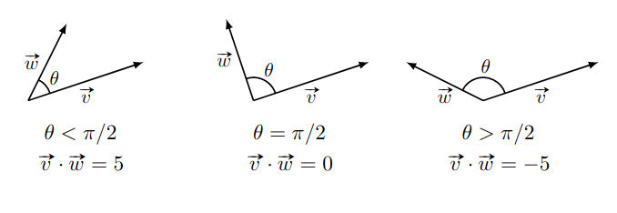
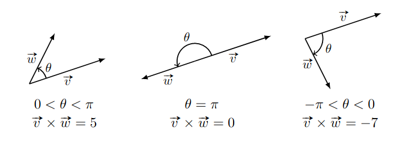

Lo que llamamos producto punto y producto cruz son formas de multiplicar vectores. La primera nos da como resultado un número mientras que la segunda nos da como resultado otro vector.

Más que conocer sus fórmulas de computo, lo valioso de estas yace en su significado geométrico.

## Producto punto

El producto punto entre el vector $v$ y el vector $w$ es el largo de la _proyección_ del vector $v$ sobre el vector $w$ multiplicado por el largo del vector $w$.

Lo importante acá está en que nos da información sobre la proyección de un vector sobre el otro. Si el producto es; **positivo** significa que forman un ángulo agudo, si es **cero** entonces son perpendiculares y por último si es **negativo** quiere decir que forman siempre un ángulo obtuso.



### Fórmula

Sea $v$ y $w$ vectores en $\mathbb{R}^2$ entonces el producto punto entre ellos es:

$$
(x_1, y_1) \cdot (x_2, y_2) = x_1x_2 + y_1y_2
$$

### Implementación

Usando la vista en [base implementation](./base_implementation).

!!! code-cpp " "
    ```cpp
    T dot(pt v, pt w) { return v.x*w.x + v.y*w.y; } // (1)!
    ```

    1. :warning: Definir esto afuera de la struct `pt`.

Además también podemos saber si dos vectores son perpendiculares o no:

!!! code-cpp " "
    ```cpp
    bool is_perp(pt v, pt w) { return dot(v, w) == 0; } // (1)!
    ```

    1. :warning: Definir esto afuera de la struct `pt`.

## Producto cruz

El producto cruz entre el vector $v$ y el vector $w$ es el vector perpendicular a ambos cuyo modulo es igual al área del paralelogramo que generan $v$ y $w$.

Al igual que en el producto anterior, lo importante no está en la fórmula si no que en el signo de su resultado. Si su producto es igual a **cero** entonces $v$ y $w$ son colineales. Por otro lado, si es **positivo** entonces $v$ a $w$ están en sentido antihorario, si es **negativo** están en sentido horario.



### Fórmula

Sea $v$ y $w$ vectores en $\mathbb{R}^2$ entonces el producto cruz entre ellos es:

$$
(x_1, y_1) \times (x_2, y_2) = x_1y_2 - y_1x_2
$$

### Implementación

Usando la vista en [base implementation](./base_implementation).

!!! code-cpp " "
    ```cpp
    T cross(pt v, pt w) { return v.x*w.y - v.y*w.x; } // (1)!
    ```

    1. :warning: Definir esto afuera de la struct `pt`.

Además también podemos saber si dos vectores son colineales o no:

!!! code-cpp " "
    ```cpp
    bool is_colinear(pt v, pt w) { return cross(v, w) == 0; } // (1)!
    ```

    1. :warning: Definir esto afuera de la struct `pt`.

## Material consultado

- [Handbook of geometry for competitive programmers](https://victorlecomte.com/cp-geo.pdf). De aquí se sacó las imágenes.
